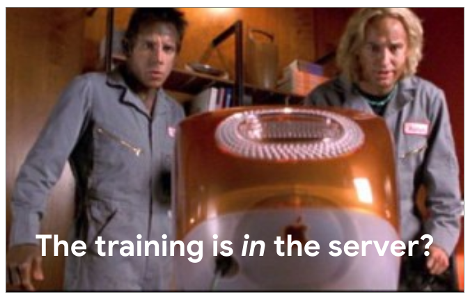
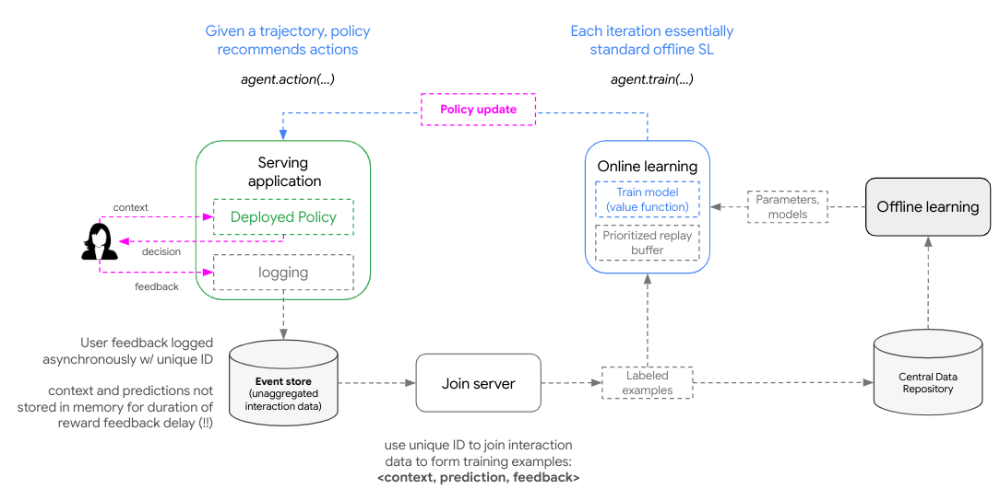
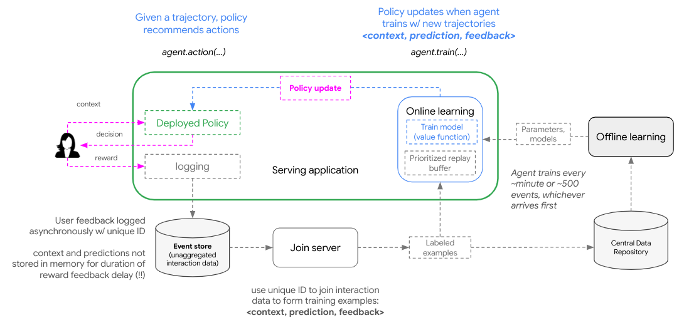
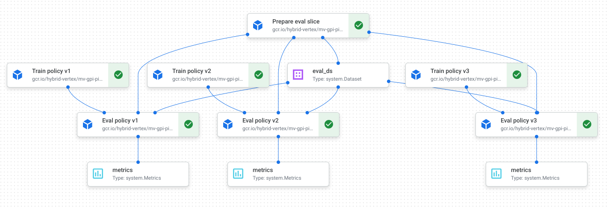

# Online learning with Contextual Bandits

In RL, *online learning* refers to agents that **learn "on-the-fly", actively rather than offline, in batch**. Online agents typically learn directly from their experiences (on-policy) as they balance exploration and exploitation: (1) generate predictions from policy, (2) process feedback re: these predictions, (3) refine policy for future predictions

* For "online learning" to take place, the agent's policy needs to be updated
* The policy is updated when the agent receives (e.g., `agent.train(...)`) new trajectories of `< previous prediction, user context, user feedback >`
* Don't need to update policy for every indivudal feedback impression; instead do in batches (gradients concepts)

| Batch learning | Online learning |
| :--------: | :------------: |
| Generates the decision rule after learning from entire training data set | data becomes available sequentially and is used to update the decision rule (policy) for future data |

## ...wait so

    

## How *online* are we?

 > To deicde between the sceanrios below, consider the expected latency of reflecting a user interaction in the system behavior (i.e., from “click” to serving a system trained on that “click”)

**Scenario 1:** inference and training deployed to seperate processes
* deployed policy generates predictions
* predictions and metadata logged with user feedback for future training
* After collecting enough samples, agent trains 
* updated policy pushed to serving application

    

**Scenario 2:** inference and training executed in same process
* implement single process for agent to train (update weights), refine policy, and generate predictions
* aka `in-memory training` or `in-process training`

    

## RL concepts
  
**Generalized Policy Iteration (GPI)**

  > see [chapter 4](http://www.incompleteideas.net/book/ebook/node40.html) of Sutton and Barto’s book, [Reinforcement Learning: an Introduction](http://www.incompleteideas.net/book/ebook/the-book.html)

    

* GPI refers to a general RL framework that uses value functions to organize and structure the search for better policies
* Specifically, GPI describes two interacting processes: (i) [policy evaluation](http://www.incompleteideas.net/book/ebook/node41.html) and (ii) [policy improvement](http://www.incompleteideas.net/book/ebook/node42.html), that eventually converge on the optimal policy and value functions as an agent interacts with an environment

  
Orchestrating policy improvment experiment

> (WIP) simulating policy improvement from online learning

    

    

