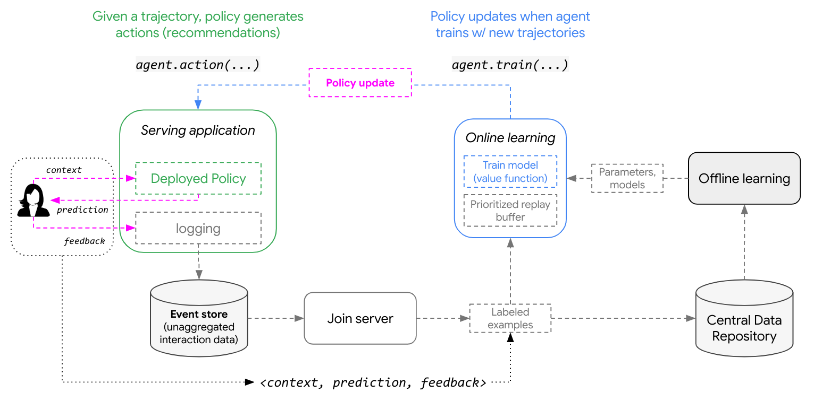
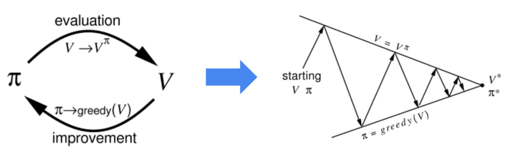

# Online learning with Contextual Bandits

    

*Online learning* refers to agents or models that learn *"on-the-fly"* (or actively) rather than offline, in batch: 

* **Batch learning**  : generates decision rule after learning from entire training data set
* **Online learning** : data becomes available sequentially and is used to update decision rule (policy) for future data

Applied to RL, the general idea follows: 

* (1) generate predictions from policy
* (2) process feedback re: these predictions
* (3) refine policy for future predictions

**What's going on??**

1. For *online learning* to take place, the agent's policy needs to be updated 
2. The policy is updated when the agent trains with new trajectories (e.g., `<user_context, prediction,feedback>` --> `agent.train(...)`)
3. A deployed policy is not updated for each individual feedback or impression that becomes available (e.g., few samples will not be enough to impact weights)
4. Instead, policy updates typically occur once a batch of logged feedback is available
5. Depending on the use case, a policy update can be triggered when ~100s of events are available or several minutes pass since the last incrmental train, whichever comes first

# Online learning: system design for RL

*Notes on determining system design*

> consider expected latency of reflecting a user interaction in the system behavior (i.e., from “click” to serving a system trained on that “click”)

*Notes on logging*

* in most high-throughput applications, the user feedback is not observed until long after the action (prediction) is made (i.e., "Delayed Feedback")
* best practice to associate a unique ID to each `<context, prediciton, feedback>` tuple, log them asynchronously (when available), and join them later (once feedback available)
* this prevents us from storing the `context` and `predictions` in a front-end server's memory for the duration of the feedback delay

## baseline architecture

> Agent handles inference and training in *seperate processes*

* deployed policy generates predictions
* predictions and metadata logged with user feedback for future training
* After collecting enough samples, agent trains 
* updated policy pushed to serving application

## `in-process` architecture

> Agent handles inference and training in *the same processes*

    

* deploys agent to single process for training and generating predictions (aka `in-memory training`)
* implements a policy that waits for checkpoint to become available
* typical requirements include:
  * ultra low serving latency
  * serving binary only allows for small (MBs) binary size increments

# RL concepts
  
**Generalized Policy Iteration (GPI)**

  > see [chapter 4](http://www.incompleteideas.net/book/ebook/node40.html) of Sutton and Barto’s book, [Reinforcement Learning: an Introduction](http://www.incompleteideas.net/book/ebook/the-book.html)

    

* GPI refers to a general RL framework that uses value functions to organize and structure the search for better policies
* Specifically, GPI describes two interacting processes: (i) [policy evaluation](http://www.incompleteideas.net/book/ebook/node41.html) and (ii) [policy improvement](http://www.incompleteideas.net/book/ebook/node42.html), that eventually converge on the optimal policy and value functions as an agent interacts with an environment

# Repo TODOs

  
Orchestrating policy improvment experiment

> (WIP) simulating policy improvement from online learning

    

    

# not familiar with the referenced meme? 

