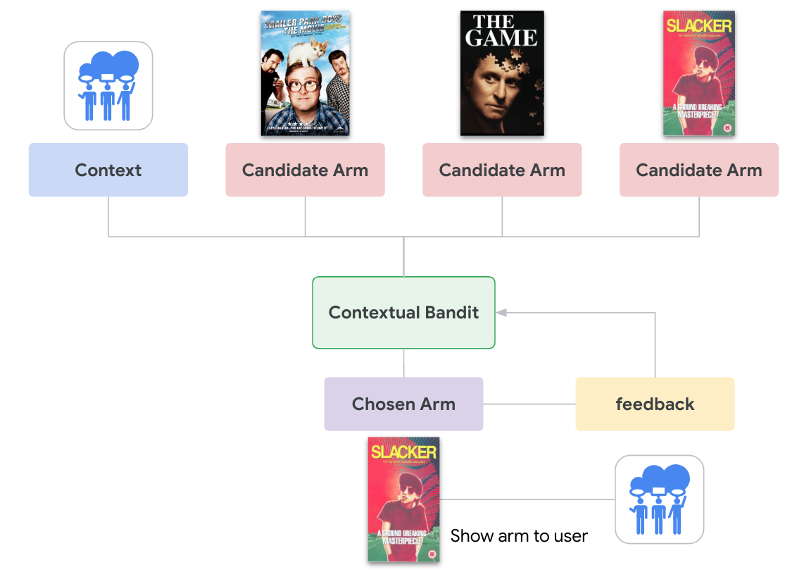
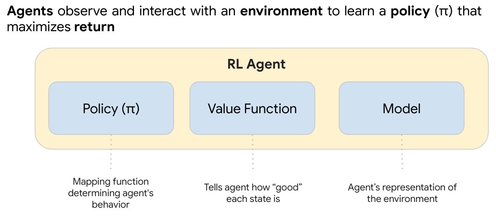

# Contextual Bandits for RecSys with Tensorflow Agents and Vertex AI 

> The goal of reinforcement learning (RL) is to build an autonomous agent that takes a sequence of actions to maximize a utility function by interacting with an external, unknown environment

## How to use this repo

This repo is organized across several notebooks and subfolders. First complete `00-env-setup.ipynb` to setup your workspace environment (e.g., enable APIs, create BigQuery and GCS assets; and then secondly, prepare the Movielens dataset with the CLI tool described in the `00-data-prep-eda` subfolder. From here, you can choose your own adventure and complete any subdirectory, in any order. 
    
Below are the high-level objectives of each notebook or set of examples. *See READMEs in each subdirectory for more details*

* [00-env-setup.ipynb](00-env-setup.ipynb) - establish naming conventions and env config for repo
* [00-data-prep-eda/](00-data-prep-eda/) - download and prepare movielens datasets for retrieval and RL use cases
* [01-offline-bandit-simulation/](01-offline-bandit-simulation/) - implement custom `environment` for online simulation
* [02-supervised-to-bandit-training/](02-supervised-to-bandit-training/) - train contextual bandits with previously collected (logged) data
* [03-ranking/](03-ranking/) - train contextual bandits for ranking problems
* [04-pipelines/](04-pipelines/) - MLOps for contextual bandits

<details>
  <summary>tensorflow versions</summary>
    
```
tf-agents==0.19.0
tensorflow==2.15.0
tensorflow-cloud==0.1.16
tensorflow-datasets==4.9.0
tensorflow-estimator==2.15.0
tensorflow-hub==0.14.0
tensorflow-io==0.29.0
tensorflow-io-gcs-filesystem==0.29.0
tensorflow-metadata==0.14.0
tensorflow-probability==0.23.0
tensorflow-serving-api==2.13.0
tensorflow-transform==0.14.0

tensorboard==2.16.2
tensorboard-data-server==0.7.1
tensorboard-plugin-wit==1.8.1
tensorboard_plugin_profile==2.15.1
tensorboardX==2.6.2.2
```
</details>

## Introduction to Contextual Bandit problems

The Contextual Bandit (CB) problem is a special case of Reinforcement Learning: an agent collects rewards in an environment by taking some actions after observing some state of the environment. The main difference between general RL and CB is that in CB, we assume that **the action taken by the agent does not influence the next state of the environment**. Therefore, agents do not model state transitions, credit rewards to past actions, or "plan ahead" to get to reward-rich states.

As in other RL domains, the goal of a Contextual Bandit agent is to find a *policy* that collects as much reward as possible. It would be a mistake, however, to always try to exploit the action that promises the highest reward, because then there is a chance that we miss out on better actions if we do not explore enough. This is the main problem to be solved in CB, often referred to as the *exploration-exploitation dilemma*.

## Why reinforcement learning?
* train algorithms that consider long-term (cumulative value) of decisions
* **Explore & Exploit tradeoffs** between short and long term value (e.g., the difference between the short term value of "click-bait" vs the long-term value of overall user satisafaction, as highlighted in  [DNN for YouTube Recommendations](https://static.googleusercontent.com/media/research.google.com/en//pubs/archive/45530.pdf))
* make a sequence of decisions, where each decision, or action, possibly impacts future decisions
* return a **distribution** over predictions rather than a single prediction*

### Applying RL to RecSys

* User vectors are the environment observations
* Items to recommend are the agent actions applied on the environment
* Approximate user ratings are the environment rewards generated as feedback to the observations and actions

| RL concept | Traditional RL | RL for RecSys |
| :--------: | :------------: | :-----------: |
|   Agent    | algorithm that learns from trial and error by interacting with the environment | candidate generator |
| Environment| world through which the agent moves / interacts | historical interaction data | 
|   State    | Current condition returned by the environment | use intersts, context |
|   Reward   | An instant return from the environment to appraise the last action | user satisfaction |
|   Action   | possible steps that an agent can take | select from a lare corpus |
|   Policy   | The approach the agent learns to use to determine the next best action based on state | equivalent to a "model" in supervised learning |

For custom training, we implement **off-policy training**, using a static set of pre-collected data records.
* Meaning, given a data record, and its observation, the current policy in training might not choose the same action as the one in said data record.

### Example: movie recommendations

Suppose we are looking to improve user engagement by recommending to a user the best movie from a set of movies. 
* The movies are the *candidate arms*
* *Context* could include user features (e.g., location, device, demographics), as well as additional features about each item (movie)
* *Feedback* could be whether the user clicked or watched a movie



### Problem formulation

basic questions we need to answer:
* how is the **environment defined:** (e.g., real or simulated environmnet)
* how do we **incentivize the agent:** (e.g., linear or non-linear rewards)
* structure and logic of the **policy** (e.g., neuarl networks or look-up tables)
* Choose a **training algorithm**

### Training data used in this repo

We use the
[MovieLens 1M dataset](https://www.tensorflow.org/datasets/catalog/movielens#movielens1m-movies)
to build a simulation environment that frames the recommendation problem:

1.  User vectors are the environment observations;
2.  Movie items to recommend are the agent actions applied on the environment;
3.  Approximate user ratings are the environment rewards generated as feedback
    to the observations and actions.

## TF-Agents concepts to understand

See the [tf_agents/bandits](https://github.com/tensorflow/agents/blob/master/tf_agents/bandits) repository for ready-to-use bandit environments, policies, and agents 

### Environments
In TF-Agents, the environment class serves the role of giving information on the current state (this is called **observation** or **context**), receiving an action as input, performing a state transition, and outputting a reward. This class also takes care of resetting when an episode ends, so that a new episode can start. This is realized by calling a `reset` function when a state is labelled as "last" of the episode. For more details, see the [TF-Agents environments tutorial](https://github.com/tensorflow/agents/blob/master/docs/tutorials/2_environments_tutorial.ipynb).

As mentioned above, CB differs from general RL in that actions do not influence the next observation. Another difference is that in Bandits, there are no "episodes": every time step starts with a new observation, independently of previous time steps.


### Agents
The algorithm used to solve an RL problem is represented by an `Agent`. Agents take care of updating a *policy* based on training samples (represented as trajectories)



Sometimes referred to as the `learner entity`, or `the brain`, which takes action for each time step toward a goal
* performs actions in an environment to gain some reward
* agent's learn when the policy is *updated*; they serve predictions when they *generate actions*

Agent's are comprised of three subcomponents:
1. **Policy (${\pi}$)**: Mapping function determining agent's behavior, RL goal is to learn optimal mapping
2. **Value function**: Tells agent how “good” each state is; gives a measure of potential future rewards from being in a state
3. **Model**: Agent’s representation of the environment

> Note: in RL terminology, *model* typically refers to some object that can make concrete predictions about future observations or features. The RL concepts of `model-based` and `model-free` refer to this definiton of the word. `Model-based`, for example, refers to algorithms using a *model* for planning, i.e., predicted future observations to improve current decision-making


### Policies
In RL terminology, policies map an observation from the environment to an action or a distribution over actions. In TF-Agents, observations from the environment are contained in a named tuple `TimeStep('step_type', 'discount', 'reward', 'observation')`, and policies map timesteps to actions or distributions over actions. Most policies use `timestep.observation`, some policies use `timestep.step_type` (e.g. to reset the state at the beginning of an episode in stateful policies), but `timestep.discount` and `timestep.reward` are usually ignored. 

Policies are related to other components in TF-Agents in the following way:
* Most policies have a neural network to compute actions and/or distributions over actions from `TimeSteps` 
* Agents can contain one or more policies for different purposes, e.g. a main policy that is being trained for deployment, and a noisy policy for data collection
* Policies can be saved/restored, and can be used indepedently of the agent for data collection, evaluation etc.

For more details, see the [TF-Agents Policy tutorial](https://github.com/tensorflow/agents/blob/master/docs/tutorials/3_policies_tutorial.ipynb).


### Trajectorties
In TF-Agents, `trajectories` are the training examples used to train an agent. More specifically, they are named tuples that contain samples from previous steps taken. These samples are then used by the agent to train and update the policy. In RL, trajectories must contain information about the current state, the next state, and whether the current episode has ended

```
Trajectory(
    {
        'action': <tf.Tensor: shape=(3, 1),
        'discount': <tf.Tensor: shape=(3, 1),
        'next_step_type': <tf.Tensor: shape=(3, 1),
        'observation': {
            'global': <tf.Tensor: shape=(3, 1, 48),
            'policy_info': PerArmPolicyInfo(
                log_probability=(), 
                predicted_rewards_mean=<tf.Tensor: shape=(3, 1, 2), 
                multiobjective_scalarized_predicted_rewards_mean=(), 
                predicted_rewards_optimistic=(), 
                predicted_rewards_sampled=(), 
                bandit_policy_type=<tf.Tensor: shape=(3, 1, 1), 
                chosen_arm_features=<tf.Tensor: shape=(3, 1, 32),
            )
            'reward': <tf.Tensor: shape=(3, 1),
            'step_type': <tf.Tensor: shape=(3, 1),
        }
    }
)
```

The [functools](https://docs.python.org/3/library/functools.html) package is commonly used to develop RL agents with TF-Agents because it provides a number of useful functions for working with nested structures of tensors 
* These functions can be used to create and manipulate data structures such as arrays, lists, and dictionaries, which are commonly used in RL algorithms
* Also used for higher-order functions (i.e., functions that act on or return other functions). In general, any callable object can be treated as a function for the purposes of this module


### Regret
Bandits' most important metric is *regret*, calculated as the difference between the reward collected by the agent and the expected reward of an oracle policy that has access to the reward functions of the environment. The [RegretMetric](https://github.com/tensorflow/agents/blob/master/tf_agents/bandits/metrics/tf_metrics.py) thus needs a `baseline_reward_fn` function that calculates the best achievable expected reward given an observation


## Track Agent training performance with Vertex AI Experiments

> Vertex AI enables users to track the steps (e.g., preprocessing, training) of an experiment run, and track inputs (e.g., algorithm, parameters, datasets) and outputs (fe.g.,, models, checkpoints, metrics) of those steps.

**How are parameters and metrics stored / organized?**
* `Experiments` describe a context that groups your runs and the artifacts you create into a logical session. For example, in this notebook you create an Experiment and log data to that experiment.
* an `Experiment Run` represents a single path/avenue that you executed while performing an experiment. A run includes artifacts that you used as inputs or outputs, and parameters that you used in this execution. An Experiment can contain multiple runs.

**Loggin' and sharin'**
* Use the Vertex AI (Python) SDK to track metrics, params, and metadata for models trained (either local or cloud) for each experiment across several experiment runs
* Link a [Managed TensorBoard](https://cloud.google.com/vertex-ai/docs/experiments/tensorboard-introduction) instance to visualize, compare, and share ML experiments with your team 
* Save time and effort by [Autologging experiment data](https://cloud.google.com/vertex-ai/docs/experiments/autolog-data) from training jobs, and [pipeline runs](https://cloud.google.com/vertex-ai/docs/experiments/add-pipelinerun-experiment) 
* To learn more, see [Introduction to Vertex AI Experiments](https://cloud.google.com/vertex-ai/docs/experiments/intro-vertex-ai-experiments)

## Profiling Agents

The profiler's overview page is an aggregated view of the host (CPU) and all devices (either GPU or TPU), and includes a performance summary, step-time graph, and potential recommendations for improving performance


**TODO: currently investigating profiler:** 
* After optimizing training loop with the `tf.function` below, the profiler cannot detect step changes
* This prevents us from getting granular performance details of the data input pipeline.

```
    ### optimized train step ###
    
    @common.function(autograph=False)
    def _train_step_fn(trajectories):

        def replicated_train_step(experience):
            return agent.train(experience).loss

        per_replica_losses = distribution_strategy.run(
            replicated_train_step, 
            args=(trajectories,)
        )
        return distribution_strategy.reduce(
            tf.distribute.ReduceOp.MEAN, 
            per_replica_losses, # loss, 
            axis=None
        )
```

### Input pipeline bottleneck analysis

> analysis tool automatically detects bottlenecks in `tf.data` input pipelines in your job


